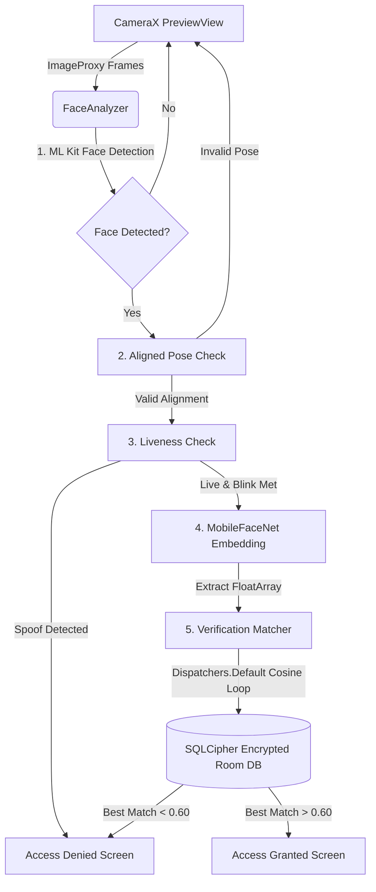
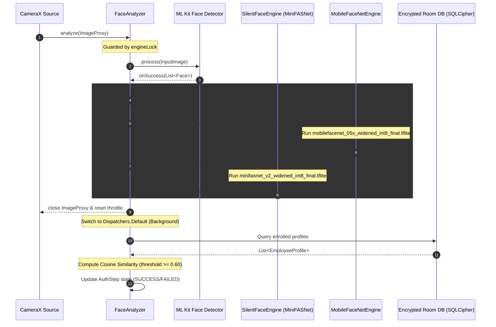

# Architecture Reference Guide - NHAI Auth Biometric Gateway

This document details the high-performance, secure biometric pipeline of the **NHAI Auth** secure gateway. The system runs offline-first edge AI models for facial identification and liveness check.

---

## 1. System Architecture Overview

NHAI Auth is built upon a layered Android Architecture using Jetpack Compose for the UI layer, Kotlin Coroutines for asynchronous work, Room (encrypted via SQLCipher) for the storage layer, and TensorFlow Lite for edge inference.



---

## 2. Dynamic Sequence Trace

The following sequence diagram details the frame analysis lifecycle within [FaceAnalyzer.kt](file:///c:/Users/kasiv/Downloads/nhai-auth/app/src/main/java/com/example/camera/FaceAnalyzer.kt) and its interactions with the AI engines and database matching loops.



---

## 3. Core Pipelines & Implementation Components

### A. AI Inference Layer
1. **Face Recognition Engine**: Implemented in [MobileFaceNetEngine.kt](file:///c:/Users/kasiv/Downloads/nhai-auth/app/src/main/java/com/example/ai/tflite/MobileFaceNetEngine.kt). It processes a cropped $112 \times 112$ RGB face image, normalized and loaded as a direct `ByteBuffer`. It outputs a 512-dimensional embedding vector.
2. **Liveness Validation Engine**: Implemented in [SilentFaceEngine.kt](file:///c:/Users/kasiv/Downloads/nhai-auth/app/src/main/java/com/example/ai/tflite/SilentFaceEngine.kt). It uses a MiniFASNet v2 model that processes a cropped $80 \times 80$ face texture to generate a liveness score (spoof threshold = `0.85f`).
3. **Dynamic Buffer Dimensioning**: To prevent size mismatch crashes between INT8 quantized and Float32 baseline TFLite model variants, both engines dynamically calculate input and output byte arrays during `initialize()` by querying the tensor metadata:
   ```kotlin
   val outputTensor = newInterpreter.getOutputTensor(0)
   isOutputFloat = outputTensor.dataType() != org.tensorflow.lite.DataType.INT8
   val size = if (isOutputFloat) dimension * 4 else dimension
   outputBuffer = ByteBuffer.allocateDirect(size)
   ```

### B. Concurrency & Lifecycle Security
- **Memory Safety and Mutex**: Image processing callbacks from ML Kit and CameraX are asynchronous. When a Jetpack Compose screen is disposed, the local CameraX resources and engines are closed. If an asynchronous frame callback fires after the interpreters are closed, it triggers a native memory segmentation fault (`SIGSEGV`).
- To prevent this, [FaceAnalyzer.kt](file:///c:/Users/kasiv/Downloads/nhai-auth/app/src/main/java/com/example/camera/FaceAnalyzer.kt) wraps the inference calls and the `close()` execution under a synchronized `engineLock` mutex block. If `isClosed` becomes true, frame processing halts immediately.

### C. Threading Model
* **Main Thread Protection**: Neural network similarity calculations and SQLite queries are blocking operations. Performing them on the Main thread causes UI stutter and Android System ANR (Application Not Responding) dialogs.
* **Background Dispatchers**: In [ScanScreen.kt](file:///c:/Users/kasiv/Downloads/nhai-auth/app/src/main/java/com/example/ui/screens/ScanScreen.kt), the similarity verification loops are wrapped in a background coroutine context:
  ```kotlin
  coroutineScope.launch(Dispatchers.Default) {
      val db = AppDatabase.getDatabase(context)
      val profiles = db.employeeDao().getAllProfiles()
      // ... compute cosine similarities ...
      withContext(Dispatchers.Main) {
          // ... update UI state (AuthStep) ...
      }
  }
  ```

### D. Offline Database Security
* **SQLCipher Encryption**: The local SQLite database, managed in [AppDatabase.kt](file:///c:/Users/kasiv/Downloads/nhai-auth/app/src/main/java/com/example/data/AppDatabase.kt), is encrypted transparently using SQLCipher. 
* **Key Derivation**: The database passphrase is dynamically derived at runtime using keys generated in the [DatabaseKeyManager.kt](file:///c:/Users/kasiv/Downloads/nhai-auth/app/src/main/java/com/example/data/security/DatabaseKeyManager.kt) using the hardware-backed Android KeyStore.
